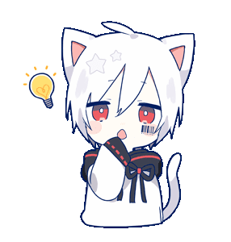

<!-- Introduction -->
  

      
      
        
      <h3>Hiya, I'm Alex 🦊</h3>
      
I am a self-taught Frontend developer and Tutor based in Porto, Portugal.

      
I am currently 23 years old and working at @ITSector. Cats, plants and Anime are my main hobbies!

  

<!-- Knowledge -->
  

    
     
    <h3 align="left">Knowledge 📦</h3>
    
I primarily work with these techonologies:

    
    
    
    
    
    
    
       
    <i>
However, I am knowledgable in a handful more technologies, I just dont utilize them as often as they wield no use to my interests.
</i>
  

<!-- Projects -->
  

    
     
    <h3>Projects 🌸</h3>
    
During my journey coding I have built a lot of different projects, some to train learn new features or tools to improve my knowledge as a developer. My Github serves as a storage room for all the information I collected on my daily bases.

    <b>
• <a href="https://github.com/AlexandreFPGoncalves/ShinyDexTracker">ShinyDexTracker</a> | <i>A FullStack application to manage hunted shiny pokémon</i>

    
• <a href="https://github.com/AlexandreFPGoncalves/ErisBot">ErisBot</a> | <i>A Discord Bot with built-in Karuta features.</i>

    
• <a href="https://github.com/AlexandreFPGoncalves/ErisBot">Zustand-Todo-List</a> | <i>Zustand State Management frontend todo-list</i></i>

    
• <a href="https://github.com/AlexandreFPGoncalves/t3-techtalk-2023">T3-Techtalk-2023</a> | <i>Company Workshop Presentation about the T3Stack</i>
</b>
  

<!-- Stats -->
  

    
     
    <h3>Stats</h3>
    
       
        
  

<!-- Contact Me -->
  

      
    
     
    <h3>Contact Me 📧</h3>
    
I primarily communicate through Discord for simplicity and easily staying connected with friends, however, if you find this non-professional feel free to contact me via email.

    
<a href="https://discord.com/users/198873253626904577">violetalex</a> | <a href="mailto:alexandrefpgoncalves@gmail.com">alexandrefpgoncalves@gmail.com</a>

    

  

   

 Thanks for Reading 💜 happy coding. 

